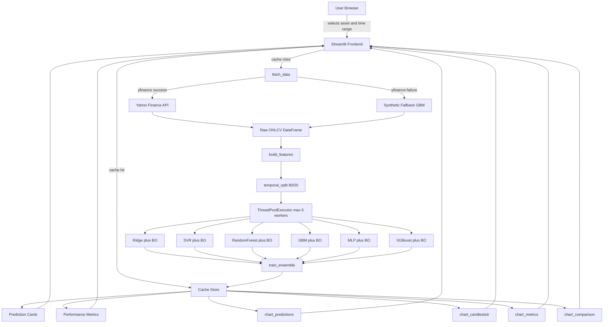
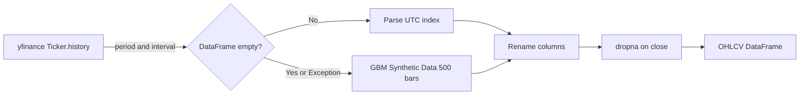
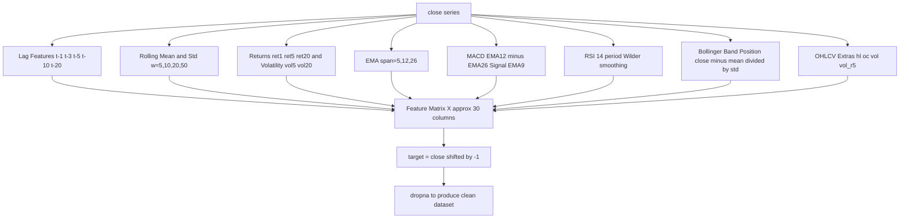
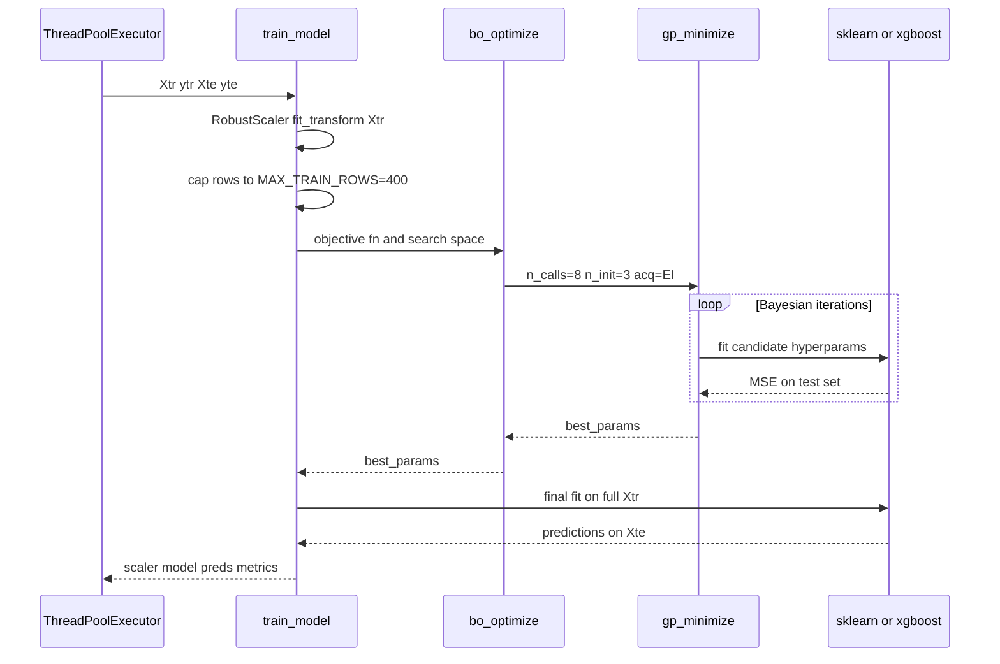
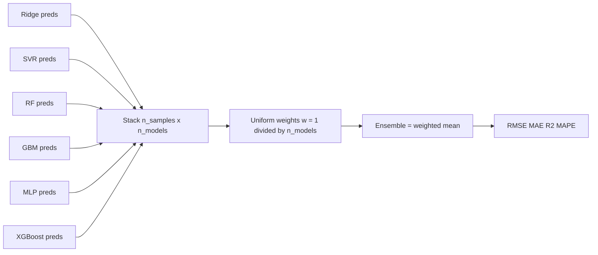
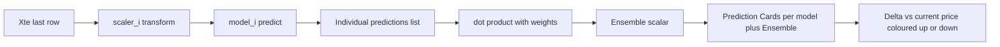
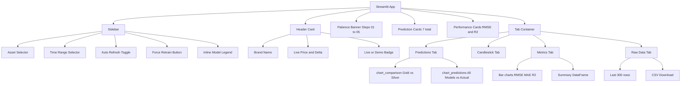
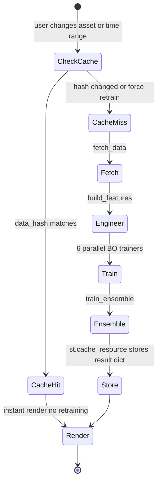

# OI's Predictions — Precious Metals Forecasting Engine

> A production-grade Streamlit application that applies **Bayesian-optimised machine learning** to real-time precious metals price forecasting. Six models are trained in parallel, each tuned via Gaussian Process optimisation, and combined into a weighted ensemble for robust next-period price prediction.

---

## Table of Contents

- [Overview](https://claude.ai/chat/922a7a06-b7ac-4d2e-a8a6-b4438cc6fc9e#overview)
- [System Architecture](https://claude.ai/chat/922a7a06-b7ac-4d2e-a8a6-b4438cc6fc9e#system-architecture)
- [Data Pipeline](https://claude.ai/chat/922a7a06-b7ac-4d2e-a8a6-b4438cc6fc9e#data-pipeline)
- [Feature Engineering](https://claude.ai/chat/922a7a06-b7ac-4d2e-a8a6-b4438cc6fc9e#feature-engineering)
- [Model Training &amp; Bayesian Optimisation](https://claude.ai/chat/922a7a06-b7ac-4d2e-a8a6-b4438cc6fc9e#model-training--bayesian-optimisation)
- [Ensemble Strategy](https://claude.ai/chat/922a7a06-b7ac-4d2e-a8a6-b4438cc6fc9e#ensemble-strategy)
- [Inference &amp; Prediction Cards](https://claude.ai/chat/922a7a06-b7ac-4d2e-a8a6-b4438cc6fc9e#inference--prediction-cards)
- [UI Architecture](https://claude.ai/chat/922a7a06-b7ac-4d2e-a8a6-b4438cc6fc9e#ui-architecture)
- [Caching Strategy](https://claude.ai/chat/922a7a06-b7ac-4d2e-a8a6-b4438cc6fc9e#caching-strategy)
- [Installation](https://claude.ai/chat/922a7a06-b7ac-4d2e-a8a6-b4438cc6fc9e#installation)
- [Usage](https://claude.ai/chat/922a7a06-b7ac-4d2e-a8a6-b4438cc6fc9e#usage)
- [Project Structure](https://claude.ai/chat/922a7a06-b7ac-4d2e-a8a6-b4438cc6fc9e#project-structure)
- [Limitations &amp; Disclaimer](https://claude.ai/chat/922a7a06-b7ac-4d2e-a8a6-b4438cc6fc9e#limitations--disclaimer)

---

## Overview

**OI's Predictions** forecasts the next-period closing price of Gold (`GC=F`) and Silver (`SI=F`) futures using a multi-model ensemble pipeline. The application is built around three core principles:

1. **Automated hyperparameter search** — Gaussian Process (GP) Bayesian Optimisation with Expected Improvement (EI) acquisition finds near-optimal hyperparameters for each model without exhaustive grid search.
2. **Parallel training** — all six models are trained concurrently via `ThreadPoolExecutor`, keeping wall-clock latency low.
3. **Temporal integrity** — train/test splits respect chronological ordering, preventing data leakage which would otherwise produce unrealistically high accuracy metrics.

---

## System Architecture

The diagram below shows the full end-to-end flow from raw market data to the rendered Streamlit dashboard.



---

## Data Pipeline



### Supported Time Ranges

| Label    | yfinance Period | Interval |
| -------- | --------------- | -------- |
| 1 Hour   | 1d              | 1m       |
| 1 Day    | 5d              | 5m       |
| 1 Week   | 1mo             | 30m      |
| 1 Month  | 3mo             | 1h       |
| 3 Months | 6mo             | 1d       |
| 6 Months | 1y              | 1d       |
| 1 Year   | 2y              | 1wk      |
| 5 Years  | 10y             | 1mo      |

The synthetic fallback uses Geometric Brownian Motion with asset-specific drift and volatility parameters (`Gold: σ=14%`, `Silver: σ=22%` annualised) so the UI remains fully functional without a live network connection.

---

## Feature Engineering

`build_features()` constructs a supervised regression dataset from raw price data. The target variable is the **next period's closing price** (`close.shift(-1)`).



All features are computed in a single pass over the DataFrame. `dropna()` is called once at the end to remove rows with NaN values introduced by lagging and rolling windows, ensuring a clean matrix with no implicit imputation.

---

## Model Training & Bayesian Optimisation

Each model is trained through an identical wrapper pattern:



### Optimised Hyperparameters per Model

| Model             | Search Space                                                       |
| ----------------- | ------------------------------------------------------------------ |
| **Ridge**         | `alpha`in [1e-3, 1e3] log-uniform                                  |
| **SVR**           | `C`in [0.1, 100] log-uniform,`epsilon`in [1e-3, 1.0] log-uniform   |
| **Random Forest** | `n_estimators`in [30, 150],`max_depth`in [3, 12]                   |
| **GBM**           | `n_estimators`in [50, 200],`lr`in [0.05, 0.3],`max_depth`in [2, 6] |
| **MLP**           | `hidden_size`in [32, 128],`alpha`in [1e-4, 0.1]                    |
| **XGBoost**       | `n_estimators`in [50, 200],`lr`in [0.05, 0.3],`max_depth`in [2, 6] |

The `DeltaXStopper(0.01)` early-stopping callback halts the GP search when successive candidate points converge, preventing wasted compute on diminishing returns.

If `scikit-optimize` is not installed, the system gracefully degrades to random search over the same space using a seeded `numpy.random.default_rng(42)`.

---

## Ensemble Strategy



The ensemble uses **uniform equal-weight averaging** across all successfully trained models. This is intentionally conservative — equal weighting is robust to individual model failures and avoids overfitting the ensemble weights to the test set. Models that fail during parallel training are silently dropped and the remainder are re-weighted automatically.

---

## Inference & Prediction Cards

Once training is complete, next-period prediction is a single forward pass using the last row of the test feature matrix:



---

## UI Architecture

The frontend is a single-page Streamlit application with four tab views. All visual components are rendered via Plotly with a unified warm-orange monochromatic theme.



### Chart Inventory

| Chart               | Type               | Key Design Decision                                                                                       |
| ------------------- | ------------------ | --------------------------------------------------------------------------------------------------------- |
| `chart_predictions` | Multi-line scatter | All 6 models drawn with distinct colors AND dash styles for accessibility                                 |
| `chart_candlestick` | OHLC candlestick   | Orange increasing / amber-800 decreasing matches theme                                                    |
| `chart_metrics`     | Horizontal bar     | `margin`excluded from `_LAY_BASE`— each chart injects its own to prevent duplicate keyword argument crash |
| `chart_comparison`  | Dual y-axis line   | Secondary y-axis for Silver prevents scale collapse given the Gold/Silver ~85x price ratio                |

---

## Caching Strategy



The `data_hash` key is derived from `f"{current_price:.2f}_{time_range}"`. This means the cache invalidates automatically when the live price ticks to a new cent value **or** when the time range changes, striking a balance between freshness and compute cost. The **Force Retrain** button calls `st.cache_resource.clear()` to bypass this entirely.

---

## Installation

```bash
# 1. Clone the repository
git clone https://github.com/your-org/ois-predictions.git
cd ois-predictions

# 2. Create a virtual environment
python -m venv .venv
source .venv/bin/activate        # Windows: .venv\Scripts\activate

# 3. Install dependencies
pip install -r requirements.txt

# 4. Run the app
streamlit run prediction.py
```

### `requirements.txt`

```
streamlit>=1.32.0
yfinance>=0.2.36
pandas>=2.0.0
numpy>=1.26.0
scikit-learn>=1.4.0
scikit-optimize>=0.9.0
plotly>=5.20.0
xgboost>=2.0.0
```

> **Note:** `xgboost` is optional. If unavailable, the XGBoost slot is automatically filled by `ExtraTreesRegressor` with no user intervention required.

---

## Usage

| Control              | Location | Effect                                        |
| -------------------- | -------- | --------------------------------------------- |
| Asset selector       | Sidebar  | Switch between Gold and Silver futures        |
| Time Range selector  | Sidebar  | Change historical window and bar interval     |
| Auto Refresh toggle  | Sidebar  | Re-runs app every N seconds (30–300s)         |
| Force Retrain button | Sidebar  | Clears cache and triggers full retraining     |
| Tab: Predictions     | Main     | All model forecasts overlaid on actual price  |
| Tab: Candlestick     | Main     | OHLC chart for selected asset and range       |
| Tab: Metrics         | Main     | RMSE, MAE, R² bar charts and comparison table |
| Tab: Raw Data        | Main     | Inspect last 300 bars, download full CSV      |

---

## Project Structure

```
ois-predictions/
│
├── prediction.py             # Single-file Streamlit application
│   ├── Constants             # ASSETS, TIME_RANGES, MODEL_COLORS
│   ├── Plotly theme          # _LAY_BASE, _ax() shared layout without margin
│   ├── fetch_data()          # yfinance with GBM synthetic fallback
│   ├── build_features()      # 30+ technical indicator feature engineering
│   ├── temporal_split()      # Chronological train/test split
│   ├── bo_optimize()         # GP Bayesian search with random fallback
│   ├── train_ridge()         # Ridge regression trainer
│   ├── train_svr()           # Support Vector Regression trainer
│   ├── train_rf()            # Random Forest trainer
│   ├── train_gbm()           # Gradient Boosting trainer
│   ├── train_mlp()           # MLP Neural Network trainer
│   ├── train_xgb()           # XGBoost or ExtraTrees trainer
│   ├── train_ensemble()      # Uniform-weight prediction aggregation
│   ├── predict_next_all()    # Single-step forward inference
│   ├── get_trained_models()  # Cached orchestration function
│   ├── chart_predictions()   # All models vs actual line chart
│   ├── chart_candlestick()   # OHLC candlestick chart
│   ├── chart_metrics()       # Horizontal bar chart per metric
│   ├── chart_comparison()    # Dual y-axis Gold vs Silver
│   └── Streamlit layout      # Sidebar Header Banner Cards Tabs Footer
│
├── requirements.txt          # Python dependencies
└── README.md                 # This file
```

---

## Limitations & Disclaimer

- **This application is for informational and research purposes only. It does not constitute financial advice.** Precious metals markets are influenced by macroeconomic, geopolitical, and structural factors that are entirely outside the scope of technical price-history models.
- The models are trained on **technical indicators derived from historical prices only** . No fundamental, sentiment, or macroeconomic data is incorporated.
- **Short time ranges** (1 Hour, 1 Day) may not contain enough bars after feature engineering to train reliably. The application enforces a minimum of 50 rows and warns the user if this threshold is not met.
- Bayesian Optimisation with `n_calls=8` is intentionally lightweight for interactive latency. Production deployments should consider increasing `BO_CALLS` and `MAX_TRAIN_ROWS` for improved model quality.
- The ensemble uses **equal weighting** . A performance-weighted or stacked ensemble would likely yield lower test error but introduces risk of overfitting to the test window.
- `yfinance` data may be delayed, incomplete, or unavailable for certain intervals. The GBM synthetic fallback ensures UI stability but predictions on synthetic data have no real-world validity.

---

_Built with Streamlit · scikit-learn · scikit-optimize · XGBoost · Plotly · yfinance_
